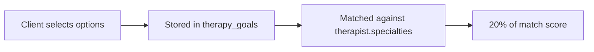
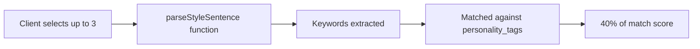
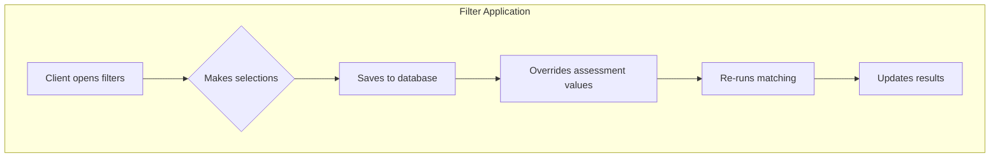

# 📋 CLIENT SELECTIONS - Complete Specification

## Assessment Questions (Initial Onboarding)

### Screen 3: "What brings you here today?"
**Component:** `/src/pages/client/Assessment.tsx` (lines 33-47)  
**Database:** `client_assessments.therapy_goals`  
**Weight:** 20% of total match score  
**Max Selections:** 7

| # | UI Display Text | Stored Value | Maps to Specialties |
|---|-----------------|--------------|---------------------|
| 1 | "Anxiety and everyday worries" | Same as display | `["Anxiety"]` |
| 2 | "Feeling low or depressed" | Same as display | `["Depression"]` |
| 3 | "Relationship challenges" | Same as display | `["Relationship and intimacy issues"]` |
| 4 | "Work and life stress" | Same as display | `["Career difficulties", "Motivation and self-esteem"]` |
| 5 | "Family and parenting" | Same as display | `["Family conflict", "Parenting issues"]` |
| 6 | "Identity and self-discovery" | Same as display | `["LGBT-related issues", "Race and racial identity", "Motivation and self-esteem"]` |
| 7 | "Past experiences and trauma" | Same as display | `["Trauma and abuse", "PTSD"]` |



### Screen 4: "I want my therapist to be..."
**Component:** `/src/pages/client/Assessment.tsx` (lines 48-66)  
**Database:** `client_assessments.communication_preferences`  
**Weight:** 40% of total match score (HIGHEST)  
**Max Selections:** 3

| # | UI Display Text | Stored Value | Keywords Parsed |
|---|-----------------|--------------|-----------------|
| 1 | "Warm and empathetic" | Same as display | `['warm', 'empathetic']` |
| 2 | "Motivational and encouraging" | Same as display | `['motivational', 'encouraging']` |
| 3 | "Solution-oriented and practical" | Same as display | `['solution-oriented', 'practical']` |
| 4 | "Pragmatic and action-focused" | Same as display | `['pragmatic', 'action-focused']` |
| 5 | "Flexible and empathetic" | Same as display | `['flexible', 'empathetic']` |
| 6 | "Structured and goal-oriented" | Same as display | `['structured', 'goal-oriented']` |
| 7 | "Exploratory and insight-based" | Same as display | `['exploratory', 'insight-based']` |
| 8 | "Calm and gentle" | Same as display | `['calm', 'gentle']` |
| 9 | "Gently challenging" | Same as display | `['gently', 'challenging']` |
| 10 | "I'm still figuring this out" | `null` | `[]` (no keywords) |



### Screen 5: Demographics (Optional)
**Component:** `/src/pages/client/Assessment.tsx` (lines 67-71)  
**Database:** Various fields in `client_assessments`  
**Weight:** Used for conditional filtering and preference boosts

| Field | Options | Database Column | Usage |
|-------|---------|-----------------|-------|
| Primary Language | 48 languages | `language_preferences` | Hard filter |
| Cultural Identity | Text input | `cultural_identity` | Preference boost |
| Gender Identity | Woman/Man/Non-binary/Prefer not to say | Used for smart options | Conditional display |
| Age Group | 18-24/25-34/35-44/45-54/55+ | `age_group` | Preference boost |
| Sexual Orientation | Various | Used for smart options | Conditional display |

### Screen 6: "It's important to me that my therapist is..."
**Database:** `client_assessments.identity_preferences`  
**Weight:** 20% of total match score  
**Dynamic:** Options shown based on demographics

| Option | Display Condition | Keywords for Matching |
|--------|------------------|----------------------|
| "Neurodiversity affirming" | Always shown | Exact match with identity_tags |
| "Trauma-informed and gentle" | Always shown | Exact match with identity_tags |
| "LGBTQ+ friendly and affirming" | If sexual_orientation != "Straight" | Exact match with identity_tags |
| "Culturally sensitive and aware" | If cultural_identity != "British" | Exact match with identity_tags |

## Filter Preferences (Post-Assessment)

### FiltersDialog Component
**Component:** `/src/components/discovery/filters-dialog.tsx`  
**Database:** Updates `client_assessments` table  
**When:** After assessment, on Discovery page

| Filter | UI Type | Database Field | Weight/Type | Options |
|--------|---------|----------------|-------------|---------|
| **Specialties** | Checkbox | `therapy_goals` | 20% weight | Anxiety, Depression, Trauma, Relationships, Work Stress, Identity, Grief, ADHD |
| **Modalities** | Checkbox | `therapy_modalities` | 15% weight | CBT, Psychodynamic, Humanistic, EMDR, DBT, Mindfulness-based |
| **Budget** | Slider | `budget_range` | Hard Filter | £20-£250 per session |
| **Gender** | Radio | `gender_preferences` | Conditional Filter | Male, Female, Non-binary, No preference |
| **Experience** | Radio | `therapist_age_preference` | Boost | No preference, Under 5 years, 5-10 years, 10+ years |
| **Times** | Checkbox | `preferred_times` | 5% weight | Morning (9am-12pm), Afternoon (12pm-5pm), Evening (5pm-9pm), Weekends |



## Data Processing Pipeline

### Keyword Extraction
**Function:** `parseStyleSentence()` in `/src/lib/matching.ts`

```javascript
// Input: "Warm and empathetic"
// Process: Split by spaces, normalize, lowercase
// Output: ['warm', 'empathetic']
```

### Storage Format
```sql
-- Example client_assessments record
{
  "communication_preferences": ["Warm and empathetic", "Structured and goal-oriented"],
  "therapy_goals": ["Anxiety and everyday worries", "Work and life stress"],
  "identity_preferences": ["Trauma-informed and gentle"],
  "therapy_modalities": ["CBT", "Mindfulness-based"],
  "budget_range": [50, 120],
  "preferred_times": ["Morning (9am-12pm)", "Evening (5pm-9pm)"],
  "gender_preferences": ["Female"],
  "age_group": "25-34"
}
```

## Validation Rules

1. **Required Fields**: None (all optional for flexibility)
2. **Max Selections**: 
   - therapy_goals: 7
   - communication_preferences: 3
   - identity_preferences: No limit
3. **Budget Range**: Min £0, Max £500
4. **Mutual Exclusivity**: Some options are mutually exclusive (handled in UI)

## Error Handling

- Empty selections default to no filtering on that dimension
- Invalid data types are sanitized before storage
- Network failures queue changes for retry
- Duplicate selections are automatically deduplicated

---

**⚠️ CRITICAL**: Any changes to client selections MUST update:
1. This documentation
2. Assessment component options
3. FiltersDialog options
4. Database schema if needed
5. Matching algorithm keyword parsing
