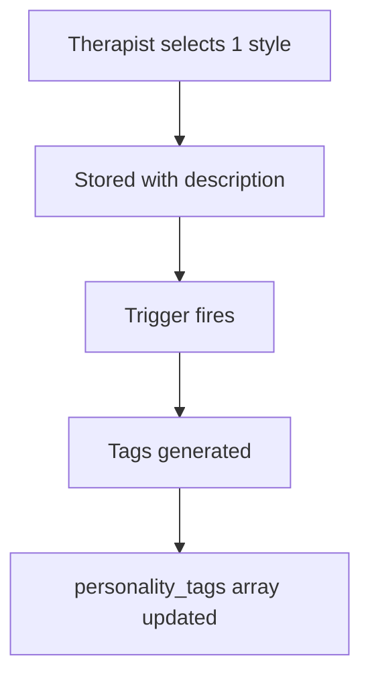
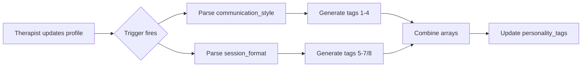

# 👩‍⚕️ THERAPIST SELECTIONS - Complete Specification

## Communication Style (Single Select - Required)
**Component:** `/src/components/therapist/communication-setup.tsx`  
**Database:** `therapist_profiles.communication_style`  
**Auto-generates:** First half of `personality_tags`  
**Weight Impact:** 40% of match score (via personality matching)

| # | UI Display | Description | Database Value | Generated Tags |
|---|-----------|-------------|----------------|----------------|
| 1 | **Supportive and Relational** | "I focus on creating safety, trust, and emotional validation" | `"Supportive and Relational"` | `['supportive', 'empathetic', 'warm']` |
| 2 | **Motivational and Encouraging** | "I focus on boosting morale, using encouragement and gentle challenge" | `"Motivational and Encouraging"` | `['motivational', 'encouraging', 'positive']` |
| 3 | **Pragmatic and Problem-solving** | "I focus on offering clear, solution-oriented feedback with actionable takeaways" | `"Pragmatic and Problem-solving"` | `['pragmatic', 'solution-oriented', 'practical']` |
| 4 | **Flexible and Adaptive** | "I am constantly shifting tone/style depending on the client's needs in the moment" | `"Flexible and Adaptive"` | `['flexible', 'adaptive', 'empathetic']` |



## Session Format (Single Select - Required)
**Component:** `/src/components/therapist/communication-setup.tsx`  
**Database:** `therapist_profiles.session_format`  
**Auto-generates:** Second half of `personality_tags`  
**Weight Impact:** 40% of match score (via personality matching)

| # | UI Display | Description | Database Value | Generated Tags |
|---|-----------|-------------|----------------|----------------|
| 1 | **Structured and Goal-oriented** | "Sessions follow a clear agenda with measurable progress markers" | `"Structured and Goal-oriented"` | `['structured', 'goal-oriented', 'focused']` |
| 2 | **Exploratory and Insight-based** | "Sessions unfold organically, focusing on deep reflection and meaning-making" | `"Exploratory and Insight-based"` | `['exploratory', 'insight-based', 'reflective']` |
| 3 | **Interactive and Dynamic** | "I switch it up with various techniques and exercises to keep energy high" | `"Interactive and Dynamic"` | `['interactive', 'dynamic', 'engaging']` |
| 4 | **Calm and Process-Focused** | "My sessions emphasise pacing, safety, and careful exploration of feelings" | `"Calm and Process-Focused"` | `['calm', 'gentle']` |

## Complete Personality Tag Combinations

### All 16 Possible Combinations
| Communication | Session | Full Tag Array | Total Tags |
|--------------|---------|----------------|------------|
| Supportive and Relational | Structured and Goal-oriented | `['supportive', 'empathetic', 'warm', 'structured', 'goal-oriented', 'focused']` | 6 |
| Supportive and Relational | Exploratory and Insight-based | `['supportive', 'empathetic', 'warm', 'exploratory', 'insight-based', 'reflective']` | 6 |
| Supportive and Relational | Interactive and Dynamic | `['supportive', 'empathetic', 'warm', 'interactive', 'dynamic', 'engaging']` | 6 |
| Supportive and Relational | Calm and Process-Focused | `['supportive', 'empathetic', 'warm', 'calm', 'gentle']` | 5 |
| Motivational and Encouraging | Structured and Goal-oriented | `['motivational', 'encouraging', 'positive', 'structured', 'goal-oriented', 'focused']` | 6 |
| Motivational and Encouraging | Exploratory and Insight-based | `['motivational', 'encouraging', 'positive', 'exploratory', 'insight-based', 'reflective']` | 6 |
| Motivational and Encouraging | Interactive and Dynamic | `['motivational', 'encouraging', 'positive', 'interactive', 'dynamic', 'engaging']` | 6 |
| Motivational and Encouraging | Calm and Process-Focused | `['motivational', 'encouraging', 'positive', 'calm', 'gentle']` | 5 |
| Pragmatic and Problem-solving | Structured and Goal-oriented | `['pragmatic', 'solution-oriented', 'practical', 'structured', 'goal-oriented', 'focused']` | 6 |
| Pragmatic and Problem-solving | Exploratory and Insight-based | `['pragmatic', 'solution-oriented', 'practical', 'exploratory', 'insight-based', 'reflective']` | 6 |
| Pragmatic and Problem-solving | Interactive and Dynamic | `['pragmatic', 'solution-oriented', 'practical', 'interactive', 'dynamic', 'engaging']` | 6 |
| Pragmatic and Problem-solving | Calm and Process-Focused | `['pragmatic', 'solution-oriented', 'practical', 'calm', 'gentle']` | 5 |
| Flexible and Adaptive | Structured and Goal-oriented | `['flexible', 'adaptive', 'empathetic', 'structured', 'goal-oriented', 'focused']` | 6 |
| Flexible and Adaptive | Exploratory and Insight-based | `['flexible', 'adaptive', 'empathetic', 'exploratory', 'insight-based', 'reflective']` | 6 |
| Flexible and Adaptive | Interactive and Dynamic | `['flexible', 'adaptive', 'empathetic', 'interactive', 'dynamic', 'engaging']` | 6 |
| Flexible and Adaptive | Calm and Process-Focused | `['flexible', 'adaptive', 'empathetic', 'calm', 'gentle']` | 5 |

## Specialties (Multi-Select)
**Component:** Therapist profile setup  
**Database:** `therapist_profiles.specialties`  
**Source:** `specialities` table (note: table name has typo)  
**Weight Impact:** 20% of match score

### Complete List (24 specialties)
```sql
-- From specialities table
1. "Anger management"
2. "Anxiety"
3. "Autism"
4. "Bipolar disorder"
5. "Bullying"
6. "Career difficulties"
7. "Chronic illness"
8. "Concentration, memory and focus (ADHD)"
9. "Coping with addictions"
10. "Depression"
11. "Eating disorders"
12. "Executive and Professional coaching"
13. "Family conflict"
14. "Grief and loss"
15. "LGBT-related issues"
16. "Motivation and self-esteem"
17. "OCD"
18. "Parenting issues"
19. "Phobias"
20. "PTSD"
21. "Race and racial identity"
22. "Relationship and intimacy issues"
23. "Tourettes syndrome"
24. "Trauma and abuse"
```

## Modalities (Multi-Select)
**Component:** Therapist profile setup  
**Database:** `therapist_profiles.modalities`  
**Source:** `modalities` table  
**Weight Impact:** 15% of match score

### Complete List (10 modalities)
```sql
-- From modalities table
1. "Cognitive Behavioural Therapy (CBT)"
2. "Compassion Focused Therapy (CFT)"
3. "EMDR Therapy"
4. "Family systems therapy"
5. "Integrative/eclectic approach"
6. "Interpersonal Therapy"
7. "Mindfulness-based Therapy (MBCT)"
8. "Person-centered Therapy"
9. "Psychodynamic therapy"
10. "Trauma-focused therapy"
```

## Identity Tags (Multi-Select)
**Component:** Therapist profile setup  
**Database:** `therapist_profiles.identity_tags`  
**Source:** `identity_tags` table (created by migration)
**Weight Impact:** 20% of match score

### Current List (4 tags)
```sql
-- Standardized identity tags after migration
1. "LGBTQ+ friendly and affirming"
2. "Neurodiversity affirming"
3. "Trauma-informed and gentle"
4. "Culturally sensitive and aware"

-- Note: Migration 20250926_standardize_identity_tags.sql will:
-- - Standardize duplicate versions (LGBTQ+ affirming → LGBTQ+ friendly and affirming)
-- - Remove "Asian-friendly" tag
-- - Create identity_tags taxonomy table
```

## Languages (Multi-Select)
**Component:** Therapist profile setup  
**Database:** `therapist_profiles.languages`  
**Source:** `languages` table  
**Weight Impact:** Hard filter (must match)

### Complete List (50 languages)
```sql
-- From languages table (alphabetical order)
1. "Amharic"
2. "Arabic"
3. "Bengali / Sylheti"
4. "British Sign Language (BSL)"
5. "Bulgarian"
6. "Burmese"
7. "Cantonese"
8. "Croatian"
9. "Czech"
10. "Danish"
11. "Dutch"
12. "English"
13. "Farsi / Dari (Persian)"
14. "Finnish"
15. "French"
16. "German"
17. "Greek"
18. "Gujarati"
19. "Haitian Creole"
20. "Hebrew"
21. "Hindi"
22. "Hungarian"
23. "Igbo"
24. "Italian"
25. "Jamaican Patois (Creole)"
26. "Kurdish"
27. "Latvian"
28. "Lithuanian"
29. "Malay (Bahasa Melayu)"
30. "Mandarin"
31. "Mongolian"
32. "Pashto"
33. "Polish"
34. "Portuguese"
35. "Punjabi"
36. "Romanian"
37. "Russian"
38. "Serbian"
39. "Slovak"
40. "Somali"
41. "Spanish"
42. "Swahili"
43. "Swedish"
44. "Tagalog / Filipino"
45. "Tamil"
46. "Thai"
47. "Turkish"
48. "Urdu"
49. "Vietnamese"
50. "Yoruba"
```

## Additional Profile Fields

| Field | Type | Database Column | Usage |
|-------|------|-----------------|-------|
| Gender Identity | Single | `gender_identity` | Conditional filter |
| Age Group | Single | `age_group` | Preference boost |
| Cultural Background | Multi | `cultural_background` | Preference boost |
| Years Experience | Single | `years_experience` | Preference boost |
| Session Rates | JSON | `session_rates` | Hard filter (budget) |
| Availability | JSON | `availability` | 5% weight |

## Database Trigger for Tag Generation

**File:** `/supabase/migrations/20250926_therapist_communication_options.sql`

```sql
CREATE OR REPLACE FUNCTION generate_personality_tags()
RETURNS TRIGGER AS $$
BEGIN
  -- Clears and regenerates personality_tags
  -- Based on communication_style and session_format
  -- Handles both short and long format values
END;
$$ LANGUAGE plpgsql;
```



## Validation Rules

1. **Required Fields**:
   - communication_style (1 selection)
   - session_format (1 selection)
   - At least 1 specialty
   - At least 1 language

2. **Auto-generation**:
   - personality_tags are ALWAYS auto-generated
   - Manual edits to personality_tags will be overwritten

3. **Format Preservation**:
   - Descriptions in parentheses are preserved in database
   - Only the base value is used for tag generation

## Data Storage Example

```json
{
  "communication_style": "Supportive and Relational (I focus on creating safety, trust, and emotional validation)",
  "session_format": "Calm and Process-Focused (My sessions emphasise pacing, safety, and careful exploration of feelings)",
  "personality_tags": ["supportive", "empathetic", "warm", "calm", "gentle"],
  "specialties": ["Anxiety", "Depression", "Trauma and abuse"],
  "modalities": ["CBT", "EMDR Therapy", "Mindfulness-based Therapy (MBCT)"],
  "identity_tags": ["LGBTQ+ friendly and affirming", "Trauma-informed and gentle"],
  "languages": ["English", "Spanish"],
  "gender_identity": "Female",
  "years_experience": "5-10 years",
  "session_rates": {"45min": 80, "60min": 100}
}
```

---

**⚠️ CRITICAL**: The personality_tags array is the PRIMARY matching field for the 40% personality compatibility score. It MUST be properly generated via the database trigger.
