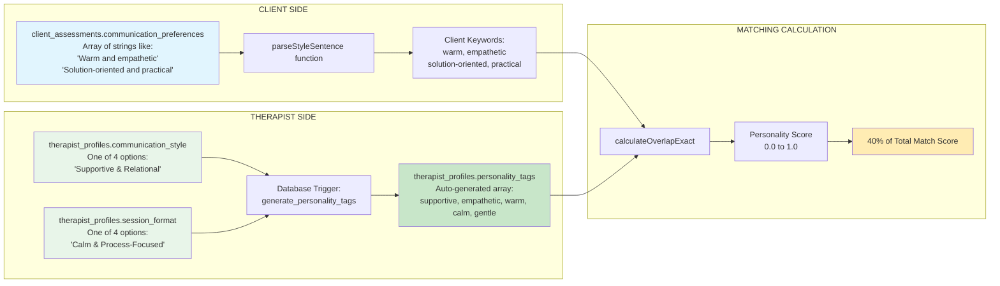
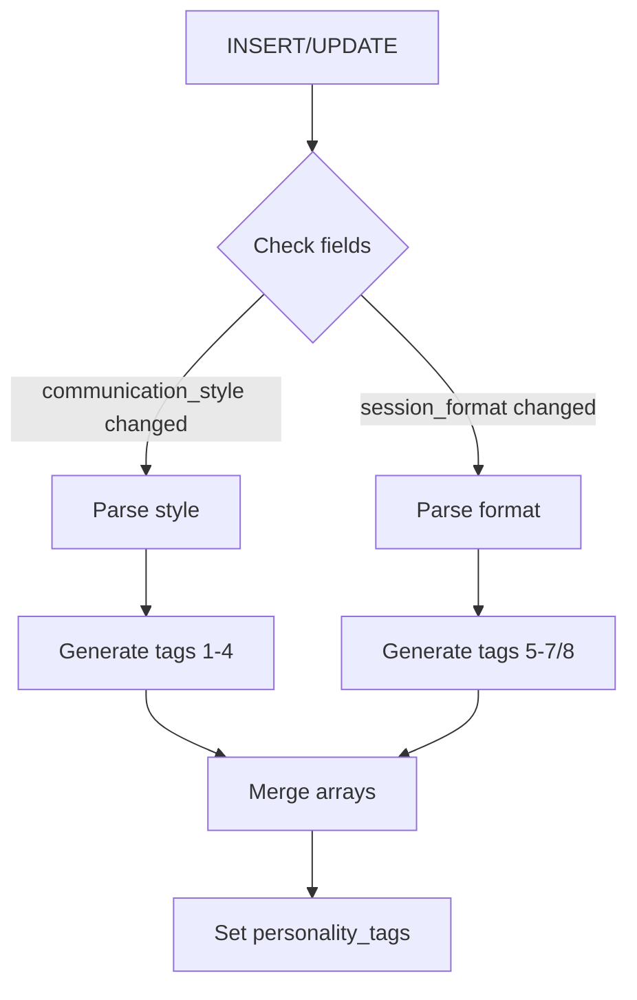

# 🗄️ DATABASE SCHEMA - Matching System Tables

## Primary Tables

### `client_assessments`
**Purpose:** Stores all client preferences and assessment data  
**RLS:** Enabled - Users can only access their own data

| Column | Type | Default | Constraints | Usage |
|--------|------|---------|-------------|-------|
| `id` | uuid | gen_random_uuid() | PRIMARY KEY | Unique identifier |
| `user_id` | uuid | - | NOT NULL, FK → auth.users | Links to user account |
| `communication_preferences` | text[] | '{}' | - | 40% weight - personality match |
| `language_preferences` | text[] | '{}' | - | Hard filter |
| `identity_preferences` | text[] | '{}' | - | 20% weight - identity match |
| `therapy_goals` | text[] | '{}' | - | 20% weight - specialty match |
| `therapy_modalities` | text[] | '{}' | - | 15% weight - modality match |
| `budget_range` | integer[] | '{0,0}' | - | Hard filter [min, max] |
| `age_group` | text | NULL | - | For preference boosts |
| `preferred_times` | text[] | '{}' | - | 5% weight - availability |
| `session_frequency` | text | NULL | - | Future use |
| `previous_therapy` | boolean | false | - | Future use |
| `crisis_support` | boolean | false | - | Future use |
| `cultural_considerations` | text[] | NULL | - | Preference boost |
| `religious_preferences` | text[] | NULL | - | Preference boost |
| `gender_preferences` | text[] | NULL | - | Conditional filter |
| `therapist_age_preference` | text | NULL | - | Maps to experience level |
| `session_length_preference` | integer | NULL | - | Future use |
| `created_at` | timestamptz | now() | - | Audit trail |
| `updated_at` | timestamptz | now() | - | Audit trail |

### `therapist_profiles`
**Purpose:** Stores therapist information for matching  
**RLS:** Enabled - Public view available via `therapist_profiles_public`

| Column | Type | Default | Constraints | Usage |
|--------|------|---------|-------------|-------|
| `id` | uuid | gen_random_uuid() | PRIMARY KEY | Unique identifier |
| `user_id` | uuid | - | NOT NULL, UNIQUE, FK | Links to user account |
| `name` | text | - | NOT NULL | Display name |
| `communication_style` | text | NULL | - | Generates personality_tags |
| `session_format` | text | NULL | - | Generates personality_tags |
| `personality_tags` | text[] | '{}' | AUTO-GENERATED | 40% weight - PRIMARY MATCH FIELD |
| `specialties` | text[] | '{}' | - | 20% weight |
| `modalities` | text[] | '{}' | - | 15% weight |
| `identity_tags` | text[] | '{}' | - | 20% weight |
| `languages` | text[] | '{}' | - | Hard filter |
| `gender_identity` | text | NULL | - | Conditional filter |
| `age_group` | text | NULL | - | Preference boost |
| `cultural_background` | text[] | '{}' | - | Preference boost |
| `years_experience` | text | NULL | - | Preference boost |
| `session_rates` | jsonb | '{}' | - | Hard filter {"45min": 80, "60min": 100} |
| `availability` | jsonb | '{}' | - | 5% weight |
| `is_active` | boolean | true | - | Must be true to appear |
| `verified` | boolean | false | - | Verification status |
| `video_url` | text | NULL | - | Introduction video |
| `avatar_url` | text | NULL | - | Profile photo |

## 🔄 40% Personality Match Data Flow



### Key Points:
1. **Client Input:** Free text selections stored as strings in `communication_preferences`
2. **Client Processing:** `parseStyleSentence()` extracts keywords, preserving hyphens
3. **Therapist Input:** Two single-select fields: `communication_style` and `session_format`
4. **Therapist Processing:** Database trigger auto-generates `personality_tags` from the two fields
5. **Matching:** Client keywords matched against therapist personality_tags
6. **Weight:** This match contributes 40% to the total compatibility score

### Therapist Tag Generation Examples:

| Communication Style | Session Format | Generated personality_tags |
|-------------------|----------------|---------------------------|
| Supportive & Relational | Calm & Process-Focused | `['supportive', 'empathetic', 'warm', 'calm', 'gentle']` |
| Motivational & Encouraging | Structured & Goal-oriented | `['motivational', 'encouraging', 'positive', 'structured', 'goal-oriented', 'focused']` |
| Pragmatic & Problem-solving | Interactive & Dynamic | `['pragmatic', 'solution-oriented', 'practical', 'interactive', 'dynamic', 'engaging']` |
| Flexible & Adaptive | Exploratory & Insight-based | `['flexible', 'adaptive', 'empathetic', 'exploratory', 'insight-based', 'reflective']` |

**Note:** There are 16 possible combinations (4 communication styles × 4 session formats)

## Taxonomy Tables

### `specialities` (note: typo in table name)
**Purpose:** Master list of therapy specialties

| Column | Type | Constraints |
|--------|------|-------------|
| `id` | uuid | PRIMARY KEY |
| `name` | text | UNIQUE, NOT NULL |
| `description` | text | NULL |

Sample data: "Anxiety", "Depression", "Trauma and abuse", etc. (24 total)

### `modalities`
**Purpose:** Master list of therapy approaches

| Column | Type | Constraints |
|--------|------|-------------|
| `id` | uuid | PRIMARY KEY |
| `name` | text | UNIQUE, NOT NULL |
| `description` | text | NULL |

Sample data: "CBT", "EMDR Therapy", "Mindfulness-based Therapy", etc. (10 total)

### `languages`
**Purpose:** Master list of supported languages

| Column | Type | Constraints |
|--------|------|-------------|
| `id` | uuid | PRIMARY KEY |
| `name` | text | UNIQUE, NOT NULL |
| `iso_code` | text | NULL |

Sample data: "English", "Spanish", "Mandarin", etc. (50 total)

### `identity_tags` (new - created by migration)
**Purpose:** Master list of identity affirmation options

| Column | Type | Constraints |
|--------|------|-------------|
| `id` | uuid | PRIMARY KEY |
| `name` | text | UNIQUE, NOT NULL |
| `description` | text | NULL |
| `created_at` | timestamptz | DEFAULT now() |

Sample data: 
- "LGBTQ+ friendly and affirming"
- "Neurodiversity affirming"
- "Trauma-informed and gentle"
- "Culturally sensitive and aware"

## ENUM Types

### `communication_style_enum`
```sql
CREATE TYPE communication_style_enum AS ENUM (
  'Supportive & Relational',
  'Motivational & Encouraging',
  'Pragmatic & Problem-solving',
  'Flexible & Adaptive'
);
```

### `session_format_enum`
```sql
CREATE TYPE session_format_enum AS ENUM (
  'Structured & Goal-oriented',
  'Exploratory & Insight-based',
  'Interactive & Dynamic',
  'Calm & Process-Focused'
);
```

## Database Triggers

### `update_personality_tags`
**Table:** therapist_profiles  
**Events:** INSERT, UPDATE of communication_style, session_format  
**Function:** generate_personality_tags()



## Views

### `therapist_profiles_public`
**Purpose:** Public-safe view of therapist profiles  
**Security:** Excludes sensitive data

```sql
CREATE VIEW therapist_profiles_public AS
SELECT 
  id,
  name,
  personality_tags,
  specialties,
  modalities,
  identity_tags,
  languages,
  gender_identity,
  age_group,
  session_rates,
  availability,
  video_url,
  avatar_url
FROM therapist_profiles
WHERE is_active = true AND verified = true;
```

## Indexes

### Performance-Critical Indexes
```sql
-- For matching queries
CREATE INDEX idx_therapist_active ON therapist_profiles(is_active);
CREATE INDEX idx_therapist_verified ON therapist_profiles(verified);
CREATE INDEX idx_therapist_languages ON therapist_profiles USING GIN(languages);
CREATE INDEX idx_therapist_specialties ON therapist_profiles USING GIN(specialties);
CREATE INDEX idx_therapist_personality ON therapist_profiles USING GIN(personality_tags);

-- For client lookups
CREATE INDEX idx_client_assessment_user ON client_assessments(user_id);
```

## RLS Policies

### client_assessments
```sql
-- Users can only see their own assessments
CREATE POLICY "Users can view own assessment" ON client_assessments
  FOR SELECT USING (auth.uid() = user_id);

-- Users can update their own assessments
CREATE POLICY "Users can update own assessment" ON client_assessments
  FOR UPDATE USING (auth.uid() = user_id);
```

### therapist_profiles
```sql
-- Public can view active, verified therapists
CREATE POLICY "Public can view active therapists" ON therapist_profiles
  FOR SELECT USING (is_active = true AND verified = true);

-- Therapists can update their own profiles
CREATE POLICY "Therapists can update own profile" ON therapist_profiles
  FOR UPDATE USING (auth.uid() = user_id);
```

## Data Integrity Rules

1. **personality_tags**: NEVER manually edit - always auto-generated
2. **budget_range**: Must be array of exactly 2 integers [min, max]
3. **session_rates**: JSON object with string keys and numeric values
4. **languages**: At least one language required for therapists
5. **specialties**: At least one specialty required for therapists

## Migration Files

- `20250926_therapist_communication_options.sql` - Adds trigger for personality_tags
- `fix-personality-tags.sql` - Repairs existing data

---

**⚠️ CRITICAL**: The personality_tags trigger is ESSENTIAL for matching to work correctly. Without it, the 40% personality compatibility score will fail.
