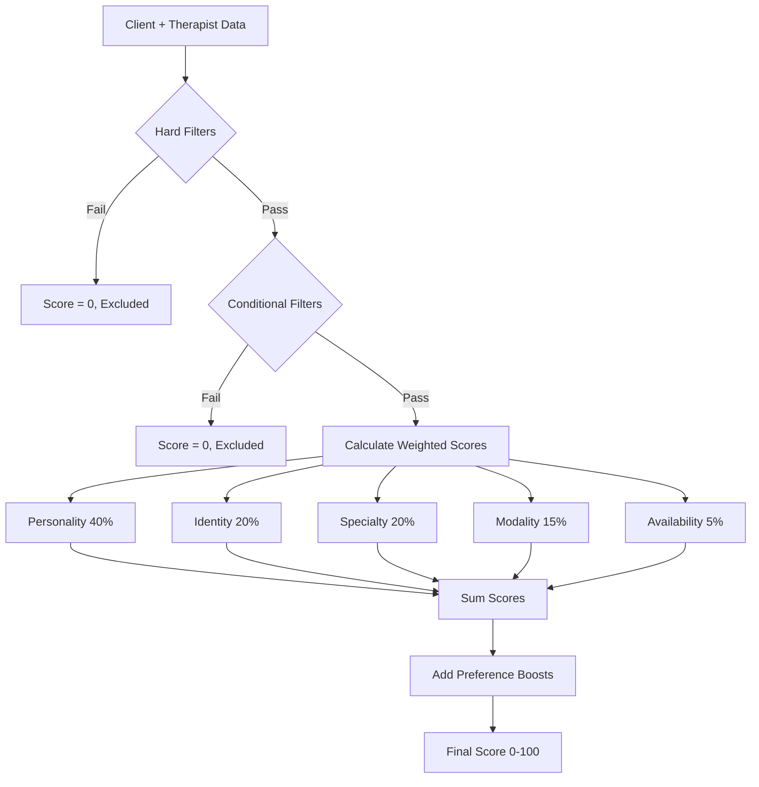

# 🧮 MATCHING ALGORITHM - Detailed Specification

**File:** `/src/lib/matching.ts`  
**Lines:** 1-494

## Algorithm Overview



## Step-by-Step Calculation

### Step 1: Hard Filters (Must Pass or Score = 0)

#### Language Filter
```typescript
// Line 270-273
const languageMatch = checkExactMatchRequired(
  assessment.language_preferences,
  therapist.languages
);

// Function (Line 134-140)
function checkExactMatchRequired(clientPrefs: string[], therapistAttrs: string[]): boolean {
  if (!clientPrefs.length) return true; // No preference = pass
  return clientPrefs.some(pref => 
    therapistAttrs.some(attr => attr.toLowerCase() === pref.toLowerCase())
  );
}
```

#### Budget Filter
```typescript
// Line 292
const budgetOk = checkBudgetHardFilter(assessment.budget_range, therapist.session_rates);

// Function (Line 167-176)
function checkBudgetHardFilter(
  clientBudget: [number, number],
  therapistRates: Record<string, number>
): boolean {
  if (!checkBudgetIsActive(clientBudget)) return true; // No budget set = pass
  const [minB, maxB] = clientBudget;
  const rates = Object.values(therapistRates || {});
  if (!rates.length) return false;
  return rates.some(r => r >= minB && r <= maxB); // At least one rate in range
}
```

### Step 2: Conditional Filters

#### Gender Preference
```typescript
// Line 310-313
const genderMatch = checkGenderPreferenceFilter(
  assessment.therapist_gender_preference,
  therapist.gender_identity
);

// If no preference or "no preference" → pass
// Otherwise must exact match
```

#### Identity Requirements
```typescript
// Line 315-316
const identityMatch = assessment.identity_preferences.length === 0 || 
  calculateOverlapExact(assessment.identity_preferences, therapist.identity_tags) > 0;
```

### Step 3: Calculate Component Scores

#### 3.1 Personality Compatibility (40%)
```typescript
// Line 335-347
const personalityScore = (() => {
  if (therapist.communication_style || therapist.session_format) {
    // Parse both client and therapist into keywords
    const clientWants = assessment.communication_preferences.flatMap(parseStyleSentence);
    const therapistHaves = [
      ...parseStyleSentence(therapist.communication_style || ''),
      ...parseStyleSentence(therapist.session_format || '')
    ];
    return calculateOverlapExact(clientWants, therapistHaves);
  }
  // Fallback to direct personality_tags comparison
  return calculateOverlapExact(assessment.communication_preferences, therapist.personality_tags);
})();
```

**parseStyleSentence (Line 99-104):**
```typescript
// "Warm and empathetic" → ['warm', 'empathetic']
function parseStyleSentence(sentence: string): string[] {
  if (!sentence) return [];
  const mainPart = sentence.split('(')[0].trim(); // Remove description
  return mainPart.replace(/&/g, ' ').split(/\s+/).map(normalize);
}
```

**calculateOverlapExact (Line 109-116):**
```typescript
// Returns fraction of client preferences satisfied
function calculateOverlapExact(client: string[], therapist: string[]): number {
  if (!client?.length || !therapist?.length) return 0;
  const c = new Set(client.map(normalize));
  const t = new Set(therapist.map(normalize));
  let hits = 0;
  for (const x of c) if (t.has(x)) hits++;
  return hits / c.size; // Fraction matched
}
```

#### 3.2 Identity Affirming (20%)
```typescript
// Line 349-352
const identityScore = calculateOverlapExact(
  assessment.identity_preferences,
  therapist.identity_tags
);
```

#### 3.3 Specialty Match (20%)
```typescript
// Line 387-395
// Map therapy goals to actual specialties for matching
const mappedSpecialties = assessment.therapy_goals
  .flatMap(goal => mapTherapyGoalToSpecialties(goal))
  .filter((value, index, self) => self.indexOf(value) === index); // Remove duplicates

const specialtyScore = calculateOverlapExact(
  mappedSpecialties,
  therapist.specialties
);
```

#### 3.4 Modality Preferences (15%)
```typescript
// Line 359-362
const modalityScore = calculateOverlapExact(
  assessment.therapy_modalities,
  therapist.modalities
);
```

#### 3.5 Availability Fit (5%)
```typescript
// Line 364-367
const availabilityScore = calculateAvailabilityFit(
  assessment.preferred_times,
  therapist.availability
);
```

### Step 4: Calculate Preference Boosts (up to 10% bonus)

#### Age Similarity
```typescript
// Line 370-374
const ageSimilarityBoost = calculateAgeSimilarity(
  assessment.age_group,
  therapist.age_group,
  assessment.prefers_similar_age
);

// Returns 0-1: 1 if same age, 0.5 if adjacent, 0 otherwise
```

#### Cultural Match
```typescript
// Line 376-380
const culturalBoost = calculateCulturalMatch(
  assessment.cultural_identity,
  therapist.cultural_background,
  assessment.prefers_cultural_background_match
);
```

#### Experience Match
```typescript
// Line 382-385
const experienceBoost = calculateExperienceMatch(
  assessment.experience_preference,
  therapist.years_experience
);
```

### Step 5: Final Score Calculation

```typescript
// Line 396-409
// Calculate weighted sum
let compatibilityScore = 
  breakdown.personality_compatibility * 0.40 +
  breakdown.identity_affirming * 0.20 +
  breakdown.specialty_match * 0.20 +
  breakdown.modality_preferences * 0.15 +
  breakdown.availability_fit * 0.05;

// Add preference boosts (max 10% additional)
const boostScore = (ageSimilarityBoost + culturalBoost + experienceBoost) / 3 * 0.1;
compatibilityScore = Math.min(1, compatibilityScore + boostScore);

// Convert to 0-100 scale
const finalScore = Math.round(compatibilityScore * 100);
```

## Example Calculations

### Example 1: Perfect Match
```javascript
Client: {
  communication_preferences: ["Warm and empathetic", "Calm and gentle"],
  therapy_goals: ["Anxiety and everyday worries"],
  identity_preferences: ["Trauma-informed and gentle"],
  therapy_modalities: ["CBT", "Mindfulness-based"],
  budget_range: [50, 120],
  preferred_times: ["Morning (9am-12pm)"]
}

Therapist: {
  personality_tags: ["warm", "empathetic", "calm", "gentle"],
  specialties: ["Anxiety", "Depression"],
  identity_tags: ["Trauma-informed and gentle"],
  modalities: ["CBT", "EMDR Therapy", "Mindfulness-based Therapy"],
  session_rates: {"60min": 100},
  availability: {"Monday": ["Morning"]}
}

Calculation:
- Personality: 4/4 keywords match = 1.0 × 0.40 = 0.40
- Identity: 1/1 match = 1.0 × 0.20 = 0.20
- Specialty: "anxiety" matches = 1.0 × 0.20 = 0.20
- Modality: 2/2 match = 1.0 × 0.15 = 0.15
- Availability: Morning matches = 1.0 × 0.05 = 0.05
Total: 0.40 + 0.20 + 0.20 + 0.15 + 0.05 = 1.0 = 100%
```

### Example 2: Partial Match
```javascript
Client: {
  communication_preferences: ["Structured and goal-oriented", "Directive and action-focused"],
  therapy_goals: ["Work and life stress", "Career difficulties"],
  // ... etc
}

Therapist: {
  personality_tags: ["supportive", "relational", "empathetic", "warm", "structured", "goal-oriented", "focused"],
  specialties: ["Anxiety", "Work stress"],
  // ... etc
}

Calculation:
- Personality: 3/6 keywords match = 0.5 × 0.40 = 0.20
- Specialty: 1/2 match = 0.5 × 0.20 = 0.10
// ... etc
Total: ~50-60%
```

## Score Interpretation

| Score Range | Match Quality | User Experience |
|------------|--------------|-----------------|
| 90-100% | Excellent | "Perfect match" badge |
| 75-89% | Very Good | Shown prominently |
| 60-74% | Good | Normal display |
| 45-59% | Fair | Lower priority |
| 30-44% | Poor | Shown if few options |
| 0-29% | Very Poor | Hidden unless requested |

## Performance Optimizations

1. **Caching:** Keywords are parsed once and cached
2. **Early Exit:** Hard filters checked first
3. **Set Operations:** O(n) complexity for comparisons
4. **Batch Processing:** Multiple therapists scored in parallel

---

**⚠️ CRITICAL**: The personality_tags must be properly populated for the algorithm to work. This is the single most important field affecting match quality.
