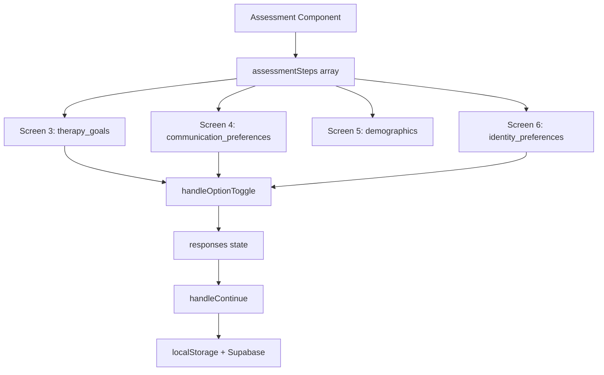
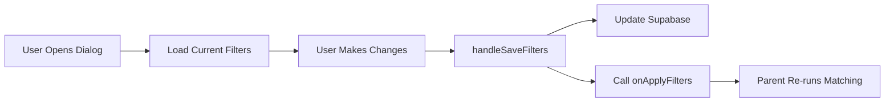
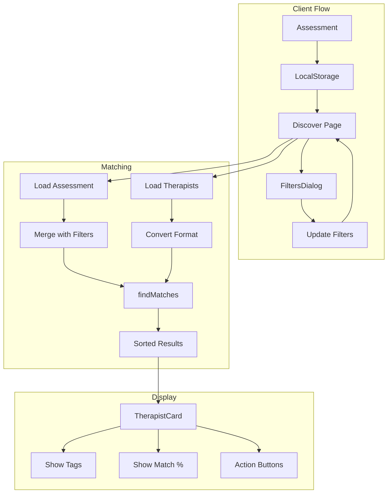

# 🎨 UI COMPONENTS - Matching System Integration

## Client-Side Components

### Assessment Component
**File:** `/src/pages/client/Assessment.tsx`  
**Lines:** 1-661

#### Props Flow


#### Key Functions
```typescript
// Line 139-155: Toggle multi-select options
const handleOptionToggle = (stepId: number, option: string) => {
  const currentResponses = responses[stepId] || [];
  const step = assessmentSteps.find(s => s.id === stepId);
  const maxOptions = step?.maxOptions || Infinity;
  
  if (currentResponses.includes(option)) {
    // Remove if selected
    setResponses({...responses, [stepId]: currentResponses.filter(r => r !== option)});
  } else if (currentResponses.length < maxOptions) {
    // Add if under limit
    setResponses({...responses, [stepId]: [...currentResponses, option]});
  }
};
```

### FiltersDialog Component
**File:** `/src/components/discovery/filters-dialog.tsx`  
**Lines:** 1-204

#### Component Structure
```typescript
interface FilterPreferences {
  specialties: string[];
  modalities: string[];
  budget_range: [number, number];
  therapist_gender: string;
  experience_level: string;
  preferred_times: string[];
}

interface FiltersDialogProps {
  open: boolean;
  onOpenChange: (open: boolean) => void;
  currentFilters?: FilterPreferences;
  onApplyFilters: (filters: FilterPreferences) => void;
}
```

#### Data Flow


### Discover Page
**File:** `/src/pages/client/Discover.tsx`  
**Lines:** 1-592

#### State Management
```typescript
// Line 112-129: Core state
const [viewedTherapists, setViewedTherapists] = useState<Set<string>>(new Set());
const [matchedTherapists, setMatchedTherapists] = useState<TherapistData[]>([]);
const [activeFilters, setActiveFilters] = useState<FilterPreferences>({
  specialties: [],
  modalities: [],
  budget_range: [20, 150],
  therapist_gender: "No preference",
  experience_level: "No preference",
  preferred_times: []
});
```

#### Matching Integration
```typescript
// Line 185-212: Load and match therapists
useEffect(() => {
  const loadTherapistData = async () => {
    // 1. Fetch client assessment
    const assessment = await fetchClientAssessment();
    
    // 2. Merge with active filters
    if (activeFilters.modalities.length > 0) {
      assessment.therapy_modalities = activeFilters.modalities;
    }
    
    // 3. Fetch therapist profiles
    const therapistProfiles = await fetchTherapistProfiles();
    
    // 4. Run matching algorithm
    const matches = findMatches(assessment, therapistProfiles);
    
    // 5. Update state
    setMatchedTherapists(matches);
  };
  
  loadTherapistData();
}, [currentUserId, activeFilters]); // Re-run on filter change
```

## Therapist-Side Components

### TherapistCard Component
**File:** `/src/components/molecules/therapist-card.tsx`  
**Lines:** 1-251

#### Props Interface
```typescript
interface TherapistCardProps {
  therapist: TherapistData;
  onPass: (therapist: TherapistData) => void;
  onSave: (therapist: TherapistData) => void;
  onShowDetails: (therapist: TherapistData) => void;
  onShowVideo: (therapist: TherapistData) => void;
  className?: string;
}
```

#### Personality Tags Display
```typescript
// Line 86-95: Tags overlay
<div className="absolute bottom-0 left-0 right-0 p-3 bg-gradient-to-t from-black/80 via-black/60 to-transparent">
  <div className="flex flex-wrap gap-1.5 justify-start">
    {tags.map((tag, index) => (
      <Tag 
        key={`${tag.category}-${tag.label}-${index}`} 
        category={tag.category} 
        size="sm" 
        className="bg-[hsl(var(--tag-personality-bg)/0.9)] text-[hsl(var(--tag-personality-text))]"
      >
        {tag.label}
      </Tag>
    ))}
  </div>
</div>
```

### CommunicationSetup Component
**File:** `/src/components/therapist/communication-setup.tsx`  
**Status:** To be created

#### Planned Structure
```typescript
interface CommunicationSetupProps {
  onComplete?: () => void;
}

const communicationStyles = [
  {
    value: "Supportive & Relational",
    label: "Supportive & Relational",
    description: "I focus on creating safety, trust, and emotional validation"
  },
  // ... 3 more options
];

const sessionFormats = [
  {
    value: "Structured & Goal-oriented",
    label: "Structured & Goal-oriented",
    description: "Sessions follow a clear agenda with measurable progress markers"
  },
  // ... 3 more options
];
```

## Data Type Definitions

### TherapistData Type
```typescript
interface TherapistData {
  id: string;
  name: string;
  title?: string;
  location?: string;
  rating: number;
  specialties: string[];
  tags: Array<{
    category: string;
    label: string;
  }>;
  media: MediaItem[];
  matchScore?: number;
  matchDetails?: {
    personality: number;
    identity: number;
    specialty: number;
    modality: number;
    availability: number;
  };
}
```

### ClientAssessment Type
```typescript
interface ClientAssessment {
  communication_preferences: string[];
  language_preferences: string[];
  identity_preferences: string[];
  therapy_goals: string[];
  therapy_modalities: string[];
  therapist_gender_preference?: string;
  budget_range: [number, number];
  experience_preference: string;
  preferred_times: string[];
  age_group: string;
  prefers_similar_age?: boolean;
  cultural_identity: string[];
  prefers_cultural_background_match?: boolean;
}
```

## Component Communication



## Error Boundaries

### Assessment Error Handling
```typescript
// Validation before save
if (currentStep === 9) {
  if (!healthDataConsent) {
    setShowConsentModal(true);
    return;
  }
  // Save to database with error handling
  try {
    await saveAssessment(assessmentData);
  } catch (error) {
    console.error('Failed to save assessment:', error);
    // Show error toast
  }
}
```

### Matching Error Handling
```typescript
try {
  const matches = findMatches(assessment, therapistProfiles);
  setMatchedTherapists(matches);
} catch (error) {
  console.error('Matching failed:', error);
  // Show fallback UI with all therapists
  setMatchedTherapists(therapistProfiles);
}
```

---

**⚠️ CRITICAL**: 
1. Components must handle missing data gracefully. If personality_tags are empty, the UI should still render but show a warning in development mode.
2. Communication preferences text IS the data - changing UI text requires updating parseStyleSentence() parsing logic.
3. Therapy goals must map to exact specialties via mapTherapyGoalToSpecialties().
