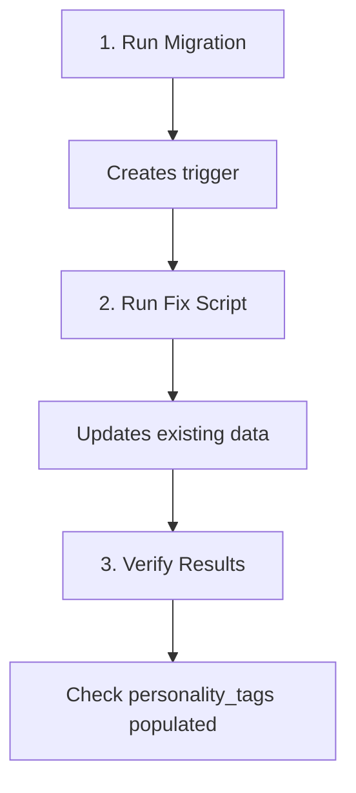

# 🔄 MIGRATIONS - Database Updates for Matching System

## Current Migration Files

### 1. Personality Tags Trigger Migration
**File:** `/supabase/migrations/20250926_therapist_communication_options.sql`  
**Status:** Ready to apply  
**Purpose:** Creates trigger to auto-generate personality_tags

```sql
-- Creates ENUM types for standardized options
CREATE TYPE IF NOT EXISTS communication_style_enum AS ENUM (
  'Supportive & Relational',
  'Motivational & Encouraging',
  'Pragmatic & Problem-solving',
  'Flexible & Adaptive'
);

CREATE TYPE IF NOT EXISTS session_format_enum AS ENUM (
  'Structured & Goal-oriented',
  'Exploratory & Insight-based',
  'Interactive & Dynamic',
  'Calm & Process-Focused'
);

-- Function to generate personality_tags
CREATE OR REPLACE FUNCTION generate_personality_tags()
RETURNS TRIGGER AS $$
BEGIN
  NEW.personality_tags := ARRAY[]::text[];
  
  -- Generate based on communication_style
  IF NEW.communication_style IS NOT NULL THEN
    CASE 
      WHEN NEW.communication_style LIKE 'Supportive & Relational%' THEN
        NEW.personality_tags := array_append(NEW.personality_tags, 'supportive');
        NEW.personality_tags := array_append(NEW.personality_tags, 'empathetic');
        NEW.personality_tags := array_append(NEW.personality_tags, 'warm');
      -- ... other cases
    END CASE;
  END IF;
  
  -- Generate based on session_format
  IF NEW.session_format IS NOT NULL THEN
    CASE 
      WHEN NEW.session_format LIKE 'Structured & Goal-oriented%' THEN
        NEW.personality_tags := array_append(NEW.personality_tags, 'structured');
        NEW.personality_tags := array_append(NEW.personality_tags, 'goal-oriented');
        NEW.personality_tags := array_append(NEW.personality_tags, 'focused');
      -- ... other cases
    END CASE;
  END IF;
  
  RETURN NEW;
END;
$$ LANGUAGE plpgsql;

-- Create trigger
DROP TRIGGER IF EXISTS update_personality_tags ON therapist_profiles;
CREATE TRIGGER update_personality_tags
  BEFORE INSERT OR UPDATE OF communication_style, session_format
  ON therapist_profiles
  FOR EACH ROW
  EXECUTE FUNCTION generate_personality_tags();
```

### 2. Data Fix Script
**File:** `/scripts/fix-personality-tags.sql`  
**Status:** Ready to apply AFTER migration  
**Purpose:** Fixes existing data to have proper personality_tags

### 3. Identity Tags Standardization
**File:** `/supabase/migrations/20250926_standardize_identity_tags.sql`  
**Status:** Ready to apply  
**Purpose:** Standardize identity tags and create taxonomy table

```sql
-- Shows current state
SELECT name, communication_style, session_format, personality_tags
FROM therapist_profiles
WHERE communication_style IS NOT NULL OR session_format IS NOT NULL;

-- Updates personality_tags with correct keywords
UPDATE therapist_profiles
SET personality_tags = 
  COALESCE(
    CASE 
      WHEN communication_style LIKE 'Supportive & Relational%' THEN 
        ARRAY['supportive', 'relational', 'empathetic', 'warm']
      -- ... other cases
    END, ARRAY[]::text[]
  ) ||
  COALESCE(
    CASE 
      WHEN session_format LIKE 'Structured & Goal-oriented%' THEN 
        ARRAY['structured', 'goal-oriented', 'focused']
      -- ... other cases
    END, ARRAY[]::text[]
  )
WHERE communication_style IS NOT NULL OR session_format IS NOT NULL;

-- OPTIONAL: Clean descriptions (currently commented out)
-- Only run after updating therapist UI to show descriptions separately
```

## Application Order



### Step 1: Apply Personality Tags Migration
```bash
# In Supabase SQL Editor
-- Copy entire content of 20250926_therapist_communication_options.sql
-- Run it
```

### Step 2: Fix Existing Personality Tags
```bash
# In Supabase SQL Editor
-- Copy entire content of fix-personality-tags.sql
-- Run it
-- Check the SELECT results before and after
```

### Step 3: Standardize Identity Tags
```bash
# In Supabase SQL Editor
-- Copy entire content of 20250926_standardize_identity_tags.sql
-- Run it
-- This will:
--   1. Merge duplicate LGBTQ+ tags → "LGBTQ+ friendly and affirming"
--   2. Merge duplicate cultural tags → "Culturally sensitive and aware"
--   3. Remove "Asian-friendly" tag
--   4. Create identity_tags taxonomy table
```

### Step 3: Verify
```sql
-- Check all therapists have tags
SELECT 
  name,
  communication_style,
  session_format,
  personality_tags,
  array_length(personality_tags, 1) as tag_count
FROM therapist_profiles
WHERE communication_style IS NOT NULL 
   OR session_format IS NOT NULL;

-- Should see 6-7 tags per therapist
```

## Rollback Plan

### If Migration Fails
```sql
-- Remove trigger
DROP TRIGGER IF EXISTS update_personality_tags ON therapist_profiles;
DROP FUNCTION IF EXISTS generate_personality_tags();

-- Remove ENUMs
DROP TYPE IF EXISTS communication_style_enum;
DROP TYPE IF EXISTS session_format_enum;
```

### If Data Fix Fails
```sql
-- Restore original personality_tags
-- (Would need backup first - always backup before running!)
UPDATE therapist_profiles
SET personality_tags = '{}';
```

## Future Migrations

### Planned: Separate Descriptions from Values
**Timeline:** After therapist UI update  
**Purpose:** Clean data structure

```sql
-- Future migration to clean values
UPDATE therapist_profiles
SET 
  communication_style = 
    CASE 
      WHEN communication_style LIKE 'Supportive & Relational%' 
        THEN 'Supportive & Relational'
      -- ... other cases
    END,
  session_format = 
    CASE 
      WHEN session_format LIKE 'Structured & Goal-oriented%' 
        THEN 'Structured & Goal-oriented'
      -- ... other cases
    END
WHERE communication_style IS NOT NULL 
   OR session_format IS NOT NULL;
```

### Planned: Add Missing Indexes
**Timeline:** Performance optimization phase  
**Purpose:** Speed up matching queries

```sql
-- Performance indexes
CREATE INDEX idx_personality_tags_gin ON therapist_profiles USING GIN(personality_tags);
CREATE INDEX idx_specialties_gin ON therapist_profiles USING GIN(specialties);
CREATE INDEX idx_modalities_gin ON therapist_profiles USING GIN(modalities);
CREATE INDEX idx_identity_tags_gin ON therapist_profiles USING GIN(identity_tags);
```

## Testing After Migration

### Test Query 1: Verify Tag Generation
```sql
-- Insert test therapist
INSERT INTO therapist_profiles (
  user_id, 
  name, 
  communication_style, 
  session_format
) VALUES (
  gen_random_uuid(),
  'Test Therapist',
  'Supportive & Relational',
  'Calm & Process-Focused'
);

-- Check tags were generated
SELECT personality_tags FROM therapist_profiles 
WHERE name = 'Test Therapist';
-- Should see: ['supportive', 'relational', 'empathetic', 'warm', 'calm', 'process-focused', 'gentle']
```

### Test Query 2: Verify Matching Works
```sql
-- Simulate matching
WITH client_prefs AS (
  SELECT ARRAY['warm', 'empathetic'] as keywords
),
therapist_tags AS (
  SELECT 
    name,
    personality_tags,
    personality_tags && (SELECT keywords FROM client_prefs) as has_match
  FROM therapist_profiles
)
SELECT * FROM therapist_tags WHERE has_match = true;
```

## Monitoring

### Check for Issues
```sql
-- Find therapists with missing tags
SELECT name, communication_style, session_format
FROM therapist_profiles
WHERE (communication_style IS NOT NULL OR session_format IS NOT NULL)
  AND (personality_tags IS NULL OR array_length(personality_tags, 1) = 0);

-- Check for duplicate tags
SELECT 
  name,
  personality_tags,
  array_length(personality_tags, 1) as total,
  array_length(ARRAY(SELECT DISTINCT unnest(personality_tags)), 1) as unique_count
FROM therapist_profiles
WHERE personality_tags IS NOT NULL;
```

---

**⚠️ CRITICAL**: 
1. ALWAYS backup data before running migrations
2. Test in staging environment first
3. Run during low-traffic periods
4. Have rollback plan ready
5. Verify results immediately after applying
