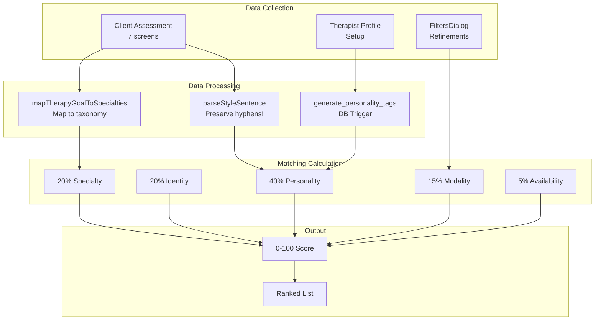

# 🧠 MINDFOLK MATCHING SYSTEM - MASTER DOCUMENTATION

**Version:** 2.0  
**Last Updated:** 2025-09-26  
**Status:** AUTHORITATIVE SOURCE OF TRUTH

> ⚠️ **CRITICAL**: This folder contains the SINGLE SOURCE OF TRUTH for the Mindfolk matching algorithm. 
> All code implementations MUST follow these specifications exactly.

## 📁 Documentation Structure

```
matching-system/
├── README.md                    (This file - Overview and Index)
├── 01-SYSTEM-OVERVIEW.md        (Algorithm weights, flow diagrams)
├── 02-CLIENT-SELECTIONS.md      (All client options and mappings)
├── 03-THERAPIST-SELECTIONS.md   (All therapist options and mappings)
├── 04-DATABASE-SCHEMA.md        (Tables, fields, constraints)
├── 05-MATCHING-ALGORITHM.md     (Detailed calculations and logic)
├── 06-UI-COMPONENTS.md          (Component specs and data flow)
├── 07-TESTING-VALIDATION.md     (Test cases and validation rules)
└── 08-MIGRATIONS.md             (SQL migrations and fixes)
```

## 🎯 Core Principle
**Personality-First Matching**: We prioritize therapeutic relationship compatibility over credentials.

## 📊 Matching Formula
```
TOTAL_SCORE = 
  (0.40 × Personality_Compatibility) +
  (0.20 × Identity_Affirming) +
  (0.20 × Specialty_Match) +
  (0.15 × Modality_Preferences) +
  (0.05 × Availability_Fit) +
  (Bonus: up to 0.10 × Preference_Boosts)
```

## 🏗️ System Architecture



## 📋 Complete Data Mapping

| Client Input | Database Field | Processing | Therapist Field | Weight | Type |
|--------------|----------------|------------|-----------------|--------|------|
| Communication preferences (Screen 4) | `client_assessments.communication_preferences` | `parseStyleSentence()` → keywords | `therapist_profiles.personality_tags` | 40% | Score |
| Therapy goals (Screen 3) | `client_assessments.therapy_goals` | `mapTherapyGoalToSpecialties()` | `therapist_profiles.specialties` | 20% | Score |
| Identity preferences (Screen 6) | `client_assessments.identity_preferences` | Exact match | `therapist_profiles.identity_tags` | 20% | Score |
| Modality preferences (Filters) | `client_assessments.therapy_modalities` | Exact match | `therapist_profiles.modalities` | 15% | Score |
| Time preferences (Filters) | `client_assessments.preferred_times` | Overlap calc | `therapist_profiles.availability` | 5% | Score |
| Budget (Filters) | `client_assessments.budget_range` | Range check | `therapist_profiles.session_rates` | - | HARD FILTER |
| Language (Screen 5) | `client_assessments.language_preferences` | Exact match | `therapist_profiles.languages` | - | HARD FILTER |
| Gender preference | `client_assessments.gender_preferences` | Exact match | `therapist_profiles.gender_identity` | - | Conditional Filter |

## 📝 Complete Client Assessment Options

### Screen 3: Therapy Goals (Maps to Specialties)
1. "Anxiety and everyday worries" → `["Anxiety"]`
2. "Feeling low or depressed" → `["Depression"]`
3. "Relationship challenges" → `["Relationship and intimacy issues"]`
4. "Work and life stress" → `["Career difficulties", "Motivation and self-esteem"]`
5. "Family and parenting" → `["Family conflict", "Parenting issues"]`
6. "Identity and self-discovery" → `["LGBT-related issues", "Race and racial identity", "Motivation and self-esteem"]`
7. "Past experiences and trauma" → `["Trauma and abuse", "PTSD"]`

### Screen 4: Communication Preferences (40% weight!)
1. "Warm and empathetic" → `['warm', 'empathetic']`
2. "Motivational and encouraging" → `['motivational', 'encouraging']`
3. "Solution-oriented and practical" → `['solution-oriented', 'practical']`
4. "Pragmatic and action-focused" → `['pragmatic', 'action-focused']`
5. "Flexible and empathetic" → `['flexible', 'empathetic']`
6. "Structured and goal-oriented" → `['structured', 'goal-oriented']`
7. "Exploratory and insight-based" → `['exploratory', 'insight-based']`
8. "Calm and gentle" → `['calm', 'gentle']`
9. "Gently challenging" → `['gently', 'challenging']`
10. "I'm still figuring this out" → `null` (no keywords)

### Screen 6: Identity Preferences (Dynamic)
- "Neurodiversity affirming" - Always shown
- "Trauma-informed and gentle" - Always shown
- "LGBTQ+ friendly and affirming" - Shown if sexual_orientation != "Straight"
- "Culturally sensitive and aware" - Shown if cultural_identity != "British"

## 👨‍⚕️ Complete Therapist Options

### Communication Styles (choose 1)
1. **"Supportive and Relational"**
   - Description: "I focus on creating safety, trust, and emotional validation"
   - Tags: `['supportive', 'empathetic', 'warm']`

2. **"Motivational and Encouraging"**
   - Description: "I focus on boosting morale, using encouragement and gentle challenge"
   - Tags: `['motivational', 'encouraging', 'positive']`

3. **"Pragmatic and Problem-solving"**
   - Description: "I focus on offering clear, solution-oriented feedback with actionable takeaways"
   - Tags: `['pragmatic', 'solution-oriented', 'practical']`

4. **"Flexible and Adaptive"**
   - Description: "I am constantly shifting tone/style depending on the client's needs in the moment"
   - Tags: `['flexible', 'adaptive', 'empathetic']`

### Session Formats (choose 1)
1. **"Structured and Goal-oriented"**
   - Description: "Sessions follow a clear agenda with measurable progress markers"
   - Tags: `['structured', 'goal-oriented', 'focused']`

2. **"Exploratory and Insight-based"**
   - Description: "Sessions unfold organically, focusing on deep reflection and meaning-making"
   - Tags: `['exploratory', 'insight-based', 'reflective']`

3. **"Interactive and Dynamic"**
   - Description: "I switch it up with various techniques and exercises to keep energy high"
   - Tags: `['interactive', 'dynamic', 'engaging']`

4. **"Calm and Process-Focused"**
   - Description: "My sessions emphasise pacing, safety, and careful exploration of feelings"
   - Tags: `['calm', 'gentle']`

## 🔍 Critical Functions and Their Purposes

```typescript
// src/lib/matching.ts - DO NOT MODIFY WITHOUT UNDERSTANDING
parseStyleSentence()           // MUST preserve hyphens: 'goal-oriented', 'solution-oriented'
mapTherapyGoalToSpecialties()  // Maps client goals to exact taxonomy specialties
calculateMatch()                // Main scoring function - DO NOT change weights
calculateOverlapExact()         // Normalized matching - critical for all scoring

// Database Trigger - AUTO-GENERATED FIELD
generate_personality_tags()     // Creates personality_tags from communication_style + session_format
```

## ⚠️ DO NOT TOUCH WITHOUT FULL UNDERSTANDING

### 🔴 CRITICAL - WILL BREAK MATCHING:

1. **`src/lib/matching.ts`**
   - `parseStyleSentence()` - MUST preserve hyphens
   - `mapTherapyGoalToSpecialties()` - MUST map to exact specialty names
   - Weight constants: `0.40, 0.20, 0.20, 0.15, 0.05`

2. **Database Triggers**
   - `generate_personality_tags` trigger on `therapist_profiles`
   - Removing or modifying breaks 40% of match score
   - Runs on INSERT/UPDATE of communication_style or session_format

3. **Database Columns**
   - `therapist_profiles.personality_tags` - AUTO-GENERATED, never manually edit
   - `therapist_profiles.communication_style` - Must be one of 4 exact values
   - `therapist_profiles.session_format` - Must be one of 4 exact values

### 🟡 HIGH RISK - CASCADING EFFECTS:

1. **Assessment Components**
   - `/src/pages/client/Assessment.tsx` (Lines 33-66)
   - Screen 3 options - Must map to specialties taxonomy
   - Screen 4 options - Must contain parseable keywords
   - Screen 6 options - Must match identity_tags exactly

2. **Therapist Setup Components**
   - Communication style selector - Must use exact 4 options
   - Session format selector - Must use exact 4 options
   - Tags auto-generate on save

3. **FiltersDialog Component**
   - `/src/components/discovery/filters-dialog.tsx`
   - Updates `client_assessments` table
   - Changes affect all scoring weights

### 🟠 MEDIUM RISK - DATA CONSISTENCY:

1. **Taxonomy Tables** (Must match exactly)
   - `specialities` table (⚠️ note typo in name!)
   - `modalities` table
   - `languages` table
   - `identity_tags` table (only 4 standardized options)

2. **Migration Sequence** (MUST run in order):
   ```sql
   1. 20250926_therapist_communication_options.sql
   2. fix-personality-tags.sql
   3. 20250926_standardize_identity_tags.sql
   ```

## ❌ COMMON PITFALLS TO AVOID

### 1. **Hyphenated Term Splitting**
❌ **WRONG:**
```typescript
'goal-oriented' → ['goal', 'oriented']  // Will NOT match!
```
✅ **RIGHT:**
```typescript
'goal-oriented' → ['goal-oriented']      // Preserves hyphen
```

### 2. **Therapy Goals as Keywords**
❌ **WRONG:**
```typescript
"Anxiety and everyday worries" → ['anxiety', 'everyday', 'worries']
```
✅ **RIGHT:**
```typescript
"Anxiety and everyday worries" → mapTherapyGoalToSpecialties() → ["Anxiety"]
```

### 3. **Manual personality_tags Editing**
❌ **WRONG:**
```sql
UPDATE therapist_profiles SET personality_tags = '{custom, tags}'
```
✅ **RIGHT:**
```sql
-- Let the trigger handle it by updating source fields
UPDATE therapist_profiles 
SET communication_style = 'Supportive and Relational',
    session_format = 'Calm and Process-Focused'
-- Trigger auto-generates: ['supportive', 'empathetic', 'warm', 'calm', 'gentle']
```

### 4. **Changing Option Text**
❌ **WRONG:** Change "Warm and empathetic" to "Warm and empathetic"
- Client option text IS the data
- Changing breaks keyword matching
- Must update parsing if text changes

## ✅ VERIFICATION CHECKLIST

After ANY change to the matching system:

- [ ] `parseStyleSentence('Solution-oriented and practical')` returns `['solution-oriented', 'practical']`
- [ ] `mapTherapyGoalToSpecialties('Anxiety and everyday worries')` returns `['Anxiety']`
- [ ] Saving therapist with communication_style triggers personality_tags generation
- [ ] Match scores range from 0-100
- [ ] Hard filters (language, budget) properly exclude non-matches
- [ ] All 5 weight components sum to 100%
- [ ] Test with known data produces expected scores

## 📊 Quick Reference Tables

### 22 Unique Personality Tags
```
supportive, empathetic, warm, motivational, encouraging, positive,
pragmatic, solution-oriented, practical, flexible, adaptive,
structured, goal-oriented, focused, exploratory, insight-based,
reflective, interactive, dynamic, engaging, calm, gentle
```

### 4 Communication Styles (Therapist)
1. `"Supportive and Relational"`
2. `"Motivational and Encouraging"`
3. `"Pragmatic and Problem-solving"`
4. `"Flexible and Adaptive"`

### 4 Session Formats (Therapist)
1. `"Structured and Goal-oriented"`
2. `"Exploratory and Insight-based"`
3. `"Interactive and Dynamic"`
4. `"Calm and Process-Focused"`

### 4 Standard Identity Tags
1. `"LGBTQ+ friendly and affirming"`
2. `"Neurodiversity affirming"`
3. `"Trauma-informed and gentle"`
4. `"Culturally sensitive and aware"`

### Therapy Goals → Specialties Mapping
- "Anxiety and everyday worries" → `["Anxiety"]`
- "Feeling low or depressed" → `["Depression"]`
- "Relationship challenges" → `["Relationship and intimacy issues"]`
- "Work and life stress" → `["Career difficulties", "Motivation and self-esteem"]`
- "Family and parenting" → `["Family conflict", "Parenting issues"]`
- "Identity and self-discovery" → `["LGBT-related issues", "Race and racial identity", "Motivation and self-esteem"]`
- "Past experiences and trauma" → `["Trauma and abuse", "PTSD"]`

## 🧮 Concrete Calculation Example

### Step-by-Step 40% Personality Match

**Client selects:** "Warm and empathetic", "Calm and gentle"
```javascript
parseStyleSentence("Warm and empathetic") → ['warm', 'empathetic']
parseStyleSentence("Calm and gentle") → ['calm', 'gentle']
// Combined: ['warm', 'empathetic', 'calm', 'gentle'] (4 keywords)
```

**Therapist has:** 
- communication_style = "Supportive and Relational"
- session_format = "Calm and Process-Focused"
```sql
-- Trigger generates:
personality_tags = ['supportive', 'empathetic', 'warm', 'calm', 'gentle']
```

**Match calculation:**
```javascript
client_wants = ['warm', 'empathetic', 'calm', 'gentle']  // 4 items
therapist_has = ['supportive', 'empathetic', 'warm', 'calm', 'gentle']  // 5 items

// calculateOverlapExact():
matches = ['warm', 'empathetic', 'calm', 'gentle']  // All 4 found!
score = 4/4 = 1.0 = 100%

// Apply weight:
final_contribution = 100% × 0.40 = 40% of total score
```

## 🔍 Debugging and Testing

### SQL Queries to Verify System

**Check if trigger is working:**
```sql
SELECT communication_style, session_format, personality_tags 
FROM therapist_profiles 
WHERE personality_tags IS NULL OR array_length(personality_tags, 1) = 0;
-- Should return 0 rows if trigger works
```

**Check for data inconsistencies:**
```sql
-- Find duplicate identity tags
SELECT unnest(identity_tags) as tag, COUNT(*) 
FROM therapist_profiles 
GROUP BY tag 
HAVING COUNT(*) > 1;
```

**Test matching for specific client:**
```sql
SELECT 
  t.name,
  t.personality_tags,
  c.communication_preferences
FROM therapist_profiles t
CROSS JOIN client_assessments c
WHERE c.user_id = 'YOUR_USER_ID'
LIMIT 5;
```

### JavaScript Console Tests

**Test parsing function:**
```javascript
// In browser console on any page with matching.ts loaded
console.log(parseStyleSentence("Solution-oriented and practical"))
// ✅ CORRECT: ['solution-oriented', 'practical']
// ❌ WRONG: ['solution', 'oriented', 'practical']

console.log(mapTherapyGoalToSpecialties("Anxiety and everyday worries"))
// ✅ CORRECT: ['Anxiety']
// ❌ WRONG: ['anxiety', 'everyday', 'worries']
```

## 🐛 Common Issues and Solutions

| Problem | Cause | Solution |
|---------|-------|----------|
| **Personality tags empty** | Trigger not installed | Run `20250926_therapist_communication_options.sql` |
| **Score always 0** | parseStyleSentence splitting hyphens | Update function to preserve hyphens |
| **No therapists match** | Hard filters too strict | Check language and budget filters |
| **Tags not updating** | Manual edits to personality_tags | Never edit directly, update source fields |
| **Wrong specialties matching** | Direct keyword parsing | Use mapTherapyGoalToSpecialties() |
| **Identity tags not matching** | String case mismatch | Ensure exact string match |

## 📊 Complete Taxonomy Lists

### 24 Specialties (from `specialities` table)
```
Anxiety, Depression, Trauma and abuse, PTSD, Relationship and intimacy issues,
Family conflict, Career difficulties, Motivation and self-esteem, Grief and loss,
Anger management, Autism, Bipolar disorder, Bullying, Chronic illness,
Concentration memory and focus (ADHD), Coping with addictions, Eating disorders,
Executive and Professional coaching, LGBT-related issues, OCD, Parenting issues,
Phobias, Race and racial identity, Tourettes syndrome
```

### 10 Modalities (from `modalities` table)
```
Cognitive Behavioural Therapy (CBT), Compassion Focused Therapy (CFT),
EMDR Therapy, Family systems therapy, Integrative/eclectic approach,
Interpersonal Therapy, Mindfulness-based Therapy (MBCT),
Person-centered Therapy, Psychodynamic therapy, Trauma-focused therapy
```

## ⚠️ Critical Implementation Notes

1. **Personality Tags**: Auto-generated via database trigger from communication_style + session_format
2. **Keyword Parsing**: Uses `parseStyleSentence()` to extract normalized keywords
3. **Hard Filters**: Language and Budget MUST match or therapist is excluded
4. **Conditional Filters**: Gender and Identity preferences may exclude therapists
5. **Score Range**: 0-100%, with 80%+ considered excellent matches

## 🚀 Quick Reference

### Client Inputs → Database Fields
- Assessment Step 3 → `therapy_goals` (20%)
- Assessment Step 4 → `communication_preferences` (40%)
- Assessment Step 6 → `identity_preferences` (20%)
- FiltersDialog → `therapy_modalities` (15%), `budget_range`, `preferred_times` (5%)

### Therapist Inputs → Database Fields
- Communication Style → `communication_style` → auto-generates `personality_tags`
- Session Format → `session_format` → auto-generates `personality_tags`
- Multi-selects → `specialties`, `modalities`, `identity_tags`, `languages`

## 🔗 Critical Dependencies

### File → Function → Effect Chain
```
Assessment.tsx (Screen 4) 
  → client_assessments.communication_preferences 
  → parseStyleSentence() 
  → 40% of match score

Assessment.tsx (Screen 3) 
  → client_assessments.therapy_goals 
  → mapTherapyGoalToSpecialties() 
  → 20% of match score

Therapist Profile Setup 
  → therapist_profiles.communication_style + session_format 
  → generate_personality_tags trigger 
  → 40% of match score
```

## 📝 File Locations

### Core Algorithm
- `/src/lib/matching.ts` - Main matching logic
- `/src/pages/client/Assessment.tsx` - Client assessment
- `/src/components/discovery/filters-dialog.tsx` - Filter preferences

### Database Migrations
- `/supabase/migrations/20250926_therapist_communication_options.sql` - Personality tag trigger
- `/scripts/fix-personality-tags.sql` - Data fix script
- `/supabase/migrations/20250926_standardize_identity_tags.sql` - Identity tag standardization

### UI Components
- `/src/pages/client/Discover.tsx` - Discovery page
- `/src/components/molecules/therapist-card.tsx` - Therapist cards
- `/src/components/therapist/communication-setup.tsx` - Therapist setup

### Documentation
- `/docs/matching-system/*` - Complete specifications
- `/docs/PERSONALITY_TAGS_RESEARCH.md` - Research backing for 22-tag system

## 🔒 Do Not Modify Without Review

Any changes to the matching system MUST:
1. Update this documentation first
2. Be reviewed by technical lead
3. Include test coverage
4. Maintain backward compatibility
5. Update all affected components

---

**⚠️ REMEMBER:** The matching system is the core of Mindfolk. Changes here affect the entire user experience. When in doubt, consult this documentation or test thoroughly before deploying.

**For detailed information on any aspect, refer to the numbered documentation files in this folder.**
