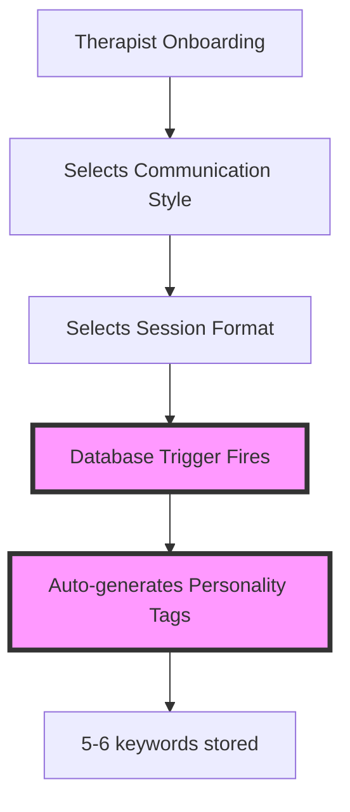
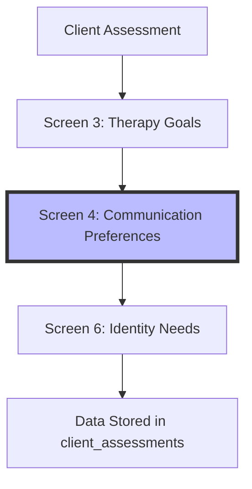
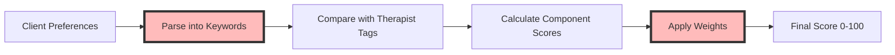

# 🧠 MINDFOLK MATCHING SYSTEM - Architecture & Reasoning

## Executive Summary

Mindfolk's matching system is a **personality-first therapeutic matching algorithm** that prioritizes the quality of the therapeutic relationship over credentials alone. This document explains WHY each component exists, HOW they work together, and WHEN to use what.

**Core Philosophy**: The best therapy outcomes come from a strong therapeutic alliance. We match clients with therapists based on interpersonal compatibility (40% weight) first, then consider specialties, identity affirmation, and practical factors.

---

## 🎯 THE BIG PICTURE

### What Makes a Good Therapy Match?

Research shows that the therapeutic relationship accounts for 30% of treatment outcomes - more than the specific modality used (15%). Our system reflects this by weighting:

```
MATCH SCORE =
  40% HOW they communicate (personality compatibility)
  20% WHO they are (identity affirmation)
  20% WHAT they specialize in (clinical expertise)
  15% HOW they work (modality preferences)
   5% WHEN they're available (practical logistics)
```

### The Two-Sided Matching Challenge

**Therapists provide:**
- Communication style (how they interact)
- Session format (how they structure sessions)
- Specialties (what issues they treat)
- Identity tags (who they affirm)
- Modalities (techniques they use)

**Clients seek:**
- Communication preferences (how they want to be spoken to)
- Therapy goals (what they need help with)
- Identity affirmation (feeling safe and understood)
- Modality preferences (techniques that resonate)
- Practical needs (budget, timing)

---

## 🔄 DATA FLOW: From Selection to Match

### Step 1: Therapist Profile Creation



**WHY THIS MATTERS**: We convert therapist selections into searchable keywords automatically. This ensures consistency and prevents manual errors.

### Step 2: Client Assessment



**WHY THIS ORDER**: We ask about goals first (practical), then communication style (most important for matching), then identity needs (safety considerations).

### Step 3: The Matching Algorithm



---

## 🧩 COMPONENT DEEP DIVE

### 1. Communication Style & Session Format (40% Weight)

**Therapeutic Reasoning**: How a therapist communicates is the foundation of the therapeutic alliance. A client who needs warmth won't thrive with a purely pragmatic approach.

#### The 4 Communication Styles

1. **Supportive and Relational**
   - For clients needing safety and validation
   - Tags: `supportive`, `empathetic`, `warm`

2. **Motivational and Encouraging**
   - For clients needing confidence building
   - Tags: `motivational`, `encouraging`, `positive`

3. **Pragmatic and Problem-solving**
   - For clients wanting concrete solutions
   - Tags: `pragmatic`, `solution-oriented`, `practical`

4. **Flexible and Adaptive**
   - For therapists who adjust to client needs
   - Tags: `flexible`, `adaptive`, `empathetic`

#### The 4 Session Formats

1. **Structured and Goal-oriented**
   - Clear agendas, measurable progress
   - Tags: `structured`, `goal-oriented`, `focused`

2. **Exploratory and Insight-based**
   - Organic unfolding, deep reflection
   - Tags: `exploratory`, `insight-based`, `reflective`

3. **Interactive and Dynamic**
   - Various techniques, high energy
   - Tags: `interactive`, `dynamic`, `engaging`

4. **Calm and Process-Focused**
   - Gentle pacing, emotional safety
   - Tags: `calm`, `gentle`

**CRITICAL**: These combine into 16 unique personality profiles (4×4 combinations).

### 2. Identity Affirmation (20% Weight)

**Therapeutic Reasoning**: Clients from marginalized communities need therapists who understand their lived experiences. This isn't just preference - it's about psychological safety.

**The 4 Identity Tags**:
- `LGBTQ+ friendly and affirming`
- `Neurodiversity affirming`
- `Trauma-informed and gentle`
- `Culturally sensitive and aware`

**Smart Display Logic**: We only show relevant options based on client demographics to avoid tokenization.

### 3. Clinical Specialties (20% Weight)

**Therapeutic Reasoning**: While relationship matters most, therapists need relevant training for specific issues.

**Mapping Logic**:
```
"Anxiety and everyday worries" → Maps to → ["Anxiety"]
"Work and life stress" → Maps to → ["Career difficulties", "Motivation and self-esteem"]
"Identity and self-discovery" → Maps to → ["LGBT-related issues", "Race and racial identity", "Motivation and self-esteem"]
```

### 4. Modality Preferences (15% Weight)

**Therapeutic Reasoning**: Different approaches work for different people. CBT might help one person while another needs somatic work.

**Common Modalities**:
- Evidence-based: CBT, DBT
- Trauma-focused: EMDR, Trauma-focused therapy
- Relational: Person-centered, Psychodynamic
- Mindfulness: MBCT, Mindfulness-based

### 5. Practical Availability (5% Weight)

**Therapeutic Reasoning**: The best match won't work if they can't meet when needed. Lower weight because flexibility often exists.

---

## 🔧 CRITICAL TECHNICAL COMPONENTS

### The Database Trigger (DO NOT REMOVE)

```sql
-- This trigger auto-generates personality_tags
-- It's the HEART of the matching system
CREATE OR REPLACE FUNCTION generate_personality_tags()
```

**WHY**: Ensures consistency. Human error in tag creation would break matching.

### The parseStyleSentence Function

```javascript
parseStyleSentence("Solution-oriented and practical")
// Returns: ['solution-oriented', 'practical']
```

**CRITICAL RULE**: NEVER split hyphenated terms. `goal-oriented` must stay as one tag.

### The calculateMatch Function

```javascript
calculateMatch(client, therapist) {
  // 1. Check hard filters first (language, budget)
  // 2. Calculate each component score (0.0-1.0)
  // 3. Apply weights
  // 4. Return score 0-100
}
```

---

## ⚠️ COMMON PITFALLS & HOW TO AVOID THEM

### Pitfall 1: Breaking Hyphenated Terms
**WRONG**: Splitting "goal-oriented" into ["goal", "oriented"]
**RIGHT**: Keep as ["goal-oriented"]
**WHY**: These are therapeutic terms with specific meanings

### Pitfall 2: Direct Keyword Extraction from Goals
**WRONG**: "Anxiety and everyday worries" → ["anxiety", "everyday", "worries"]
**RIGHT**: Use mapTherapyGoalToSpecialties() → ["Anxiety"]
**WHY**: Client language doesn't match clinical taxonomy

### Pitfall 3: Manually Editing personality_tags
**WRONG**: UPDATE therapist_profiles SET personality_tags = ...
**RIGHT**: Update source fields, let trigger regenerate
**WHY**: Manual edits break consistency and get overwritten

### Pitfall 4: Changing UI Text Without Updating Parsing
**WRONG**: Change "Warm and empathetic" to "Warm & empathetic"
**RIGHT**: Keep consistent or update parseStyleSentence()
**WHY**: The UI text IS the data - changing it breaks matching

### Pitfall 5: Assuming Empty Preferences = No Match
**WRONG**: No preferences selected = 0% match
**RIGHT**: No preferences = 100% match (everyone is suitable)
**WHY**: Allows browsing without forcing choices

---

## 📊 DECISION TREES FOR COMMON SCENARIOS

### "Should I modify the matching weights?"

```
Is Caroline (the founder) requesting this?
├─ NO → Don't change them
└─ YES → Is the sum still 100%?
    ├─ NO → Fix the math first
    └─ YES → Update all documentation
```

### "Should I add a new therapist selection option?"

```
Does it fit into existing categories?
├─ YES → Add to appropriate taxonomy table
└─ NO → Does it affect matching?
    ├─ NO → Add as profile field only
    └─ YES → Requires full system update:
        - Update trigger for tag generation
        - Update client assessment options
        - Update parseStyleSentence if needed
        - Update all documentation
```

### "Client matching seems wrong"

```
Check in this order:
1. Are personality_tags properly generated?
   └─ Run: SELECT communication_style, session_format, personality_tags FROM therapist_profiles
2. Is parseStyleSentence working?
   └─ Test: parseStyleSentence("Solution-oriented and practical")
3. Are therapy goals mapping correctly?
   └─ Test: mapTherapyGoalToSpecialties("Anxiety and everyday worries")
4. Are weights correct (40/20/20/15/5)?
   └─ Check: calculateMatch function weights
```

---

## 🚀 QUICK START GUIDES

### For Database Changes

1. **ALWAYS** check if change affects personality_tags trigger
2. **NEVER** modify personality_tags directly
3. **TEST** trigger after any communication/session changes
4. **VERIFY** with: `SELECT * FROM therapist_profiles WHERE personality_tags IS NULL`

### For UI Changes

1. **PRESERVE** exact text in assessment options
2. **MATCH** filter options to assessment options
3. **TEST** that selections save correctly
4. **VERIFY** stored data matches UI selections

### For Algorithm Changes

1. **MAINTAIN** weights sum to 100%
2. **PRESERVE** hyphenated terms
3. **MAP** therapy goals to specialties
4. **TEST** with known client-therapist pairs

---

## 📋 TESTING CHECKLIST

Before ANY deployment involving matching:

```bash
# 1. Database integrity
SELECT COUNT(*) FROM therapist_profiles WHERE personality_tags IS NULL;
-- Should return 0

# 2. Trigger functioning
UPDATE therapist_profiles
SET communication_style = 'Supportive and Relational'
WHERE id = 'test-id';
-- Check personality_tags updated

# 3. JavaScript parsing
console.log(parseStyleSentence('Goal-oriented and structured'));
// Must return ['goal-oriented', 'structured']

# 4. Specialty mapping
console.log(mapTherapyGoalToSpecialties('Work and life stress'));
// Must return ['Career difficulties', 'Motivation and self-esteem']

# 5. Weight verification
// Check that all weights in calculateMatch sum to 1.0 (100%)
```

---

## 🤝 HANDOFF PROTOCOLS

### When to Call Which Agent

**FOUNDATION AGENT**: Database schema, triggers, RLS policies
**THERAPIST-ONBOARDING AGENT**: Therapist selection UI, profile completion
**CLIENT-EXPERIENCE AGENT**: Client assessment, results display
**UI-AGENT**: Component styling, responsive design
**MATCHING-ALGORITHM AGENT**: ANY change to matching logic

### Keywords That Trigger Matching Agent

- "matching", "algorithm", "personality tags"
- "communication style", "session format"
- "match score", "compatibility"
- "parseStyleSentence", "calculateMatch"

---

## 💡 REMEMBER

1. **The therapeutic relationship is paramount** - That's why personality gets 40%
2. **Automation prevents errors** - Let triggers handle tag generation
3. **Consistency is critical** - Same text everywhere in the system
4. **Empty preferences = everyone matches** - Don't force choices
5. **Test with real scenarios** - Abstract tests miss edge cases

**This system is the heart of Mindfolk. Treat it with care.**

---

*Last Updated: 2025-01-30*
*Version: 1.0.0*
*Status: Living Document - Update as system evolves*