# App Navigation Flow

```mermaid
flowchart TD
    %% Public Routes
    Landing["/\nLanding Page"] --> Assessment["/assessment\nAssessment"]
    Landing --> TherapistLanding["/therapist\nTherapist Landing"]
    Landing --> SignIn["/sign-in\nSign In"]
    Landing --> SignUp["/sign-up\nSign Up"]
    
    %% Legal Pages
    Landing --> Terms["/legal/terms\nTerms of Service"]
    Landing --> Privacy["/legal/privacy\nPrivacy Policy"]
    
    %% Assessment Flow
    Assessment --> Discover["/discover\nDiscover Therapists"]
    SignIn --> Discover
    SignUp --> Discover
    
    %% Client Routes
    Discover --> TherapistDetail["/therapists/:id\nTherapist Detail"]
    TherapistDetail --> BookAppointment["/book/:id\nBook Appointment"]
    
    %% Client Dashboard Navigation
    Discover --> Appointments["/appointments\nAppointments"]
    Discover --> Favorites["/favorites\nFavorites"]
    Discover --> Messages["/messages\nMessages"]
    Discover --> Notifications["/notifications\nNotifications"]
    Discover --> Account["/account\nAccount"]
    Discover --> Billing["/billing\nBilling"]
    Discover --> ClientTasks["/client/tasks\nClient Tasks"]
    
    %% Cross-Client Navigation
    Appointments --> Messages
    Appointments --> TherapistDetail
    Favorites --> BookAppointment
    Favorites --> Discover
    
    %% Session Flow
    Appointments --> SessionRoom["/session/:sessionId\nSession Room"]
    BookAppointment --> SessionRoom
    
    %% Therapist Routes
    TherapistLanding --> TherapistOnboarding["/t/onboarding\nTherapist Onboarding"]
    TherapistOnboarding --> TherapistProfile["/t/profile\nTherapist Profile"]
    TherapistProfile --> TherapistDashboard["/t/dashboard\nTherapist Dashboard"]
    
    %% Therapist Dashboard Navigation
    TherapistDashboard --> TherapistAvailability["/t/availability\nAvailability"]
    TherapistDashboard --> TherapistBookings["/t/bookings\nBookings"]
    TherapistDashboard --> TherapistClients["/t/clients\nClients"]
    TherapistDashboard --> TherapistAnalytics["/t/analytics\nAnalytics"]
    TherapistDashboard --> TherapistMessages["/t/messages\nMessages"]
    TherapistDashboard --> TherapistPayouts["/t/payouts\nPayouts"]
    TherapistDashboard --> TherapistEarnings["/t/earnings\nEarnings"]
    TherapistDashboard --> TherapistTasks["/t/tasks\nTasks"]
    
    %% Admin Routes
    AdminOverview["/admin/overview\nAdmin Overview"]
    AdminOverview --> AdminUsers["/admin/users\nUser Management"]
    AdminOverview --> AdminTherapists["/admin/therapists\nTherapist Management"]
    AdminOverview --> AdminModeration["/admin/moderation\nModeration"]
    AdminOverview --> AdminBookings["/admin/bookings\nBookings Management"]
    AdminOverview --> AdminFeatureFlags["/admin/feature-flags\nFeature Flags"]
    AdminOverview --> AdminWebhooks["/admin/webhooks\nWebhooks"]
    AdminOverview --> AdminAudit["/admin/audit\nAudit Logs"]
    AdminOverview --> AdminSupport["/admin/support\nSupport"]
    AdminOverview --> AdminTasks["/admin/tasks\nAdmin Tasks"]
    
    %% Dev Routes
    DevScreenshots["/dev/screenshots\nScreenshot Capture"]
    DevSessionManagement["/dev/session-management\nSession Management Demo"]
    
    %% Error Handling
    NotFound["/404\nNot Found Page"]
    
    %% Navigation Components
    subgraph "Navigation Components"
        Header["Header\n- Logo → Landing\n- Find Therapist → Discover\n- For Therapists → TherapistLanding\n- Sign In → SignIn\n- Get Started → SignUp\n- Notifications → Notifications"]
        
        ClientNav["Client Navigation\n- Discover\n- Favorites\n- Appointments\n- Messages\n- Notifications\n- Account\n- Billing\n- Tasks"]
        
        TherapistNav["Therapist Navigation\n- Dashboard\n- Clients\n- Bookings\n- Messages\n- Analytics\n- Earnings\n- Profile\n- Settings"]
        
        BottomNav["Bottom Navigation (Mobile)\n- Home → Discover\n- Favorites\n- Appointments\n- Profile → Account"]
    end
    
    %% Styling
    classDef publicRoute fill:#E3ECF5
    classDef clientRoute fill:#EBF1ED
    classDef therapistRoute fill:#FFF3EB
    classDef adminRoute fill:#FADBD8
    classDef devRoute fill:#EAE3DC
    classDef sessionRoute fill:#FADBD8
    
    class Landing,Assessment,TherapistLanding,SignIn,SignUp,Terms,Privacy publicRoute
    class Discover,TherapistDetail,BookAppointment,Appointments,Favorites,Messages,Notifications,Account,Billing,ClientTasks clientRoute
    class TherapistOnboarding,TherapistProfile,TherapistDashboard,TherapistAvailability,TherapistBookings,TherapistClients,TherapistAnalytics,TherapistMessages,TherapistPayouts,TherapistEarnings,TherapistTasks therapistRoute
    class AdminOverview,AdminUsers,AdminTherapists,AdminModeration,AdminBookings,AdminFeatureFlags,AdminWebhooks,AdminAudit,AdminSupport,AdminTasks adminRoute
    class DevScreenshots,DevSessionManagement devRoute
    class SessionRoom sessionRoute
```

## Key Navigation Patterns:

### 🔵 **Public Flow**
- Landing → Assessment → Discover (main user journey)
- Landing → Sign In/Up → Discover (returning users)

### 🟢 **Client Flow** 
- Discover therapists → View details → Book appointments
- Navigate between appointments, favorites, messages, account
- Join therapy sessions from appointments

### 🟠 **Therapist Flow**
- Onboarding → Profile setup → Dashboard
- Manage clients, bookings, earnings from dashboard
- Handle messages and analytics

### 🔴 **Admin Flow**
- Centralized admin overview
- Manage users, therapists, and system settings

### 🟣 **Session Flow**
- Appointments or bookings → Live therapy sessions
- Session reminders and countdown components

### 📱 **Mobile Navigation**
- Bottom navigation for core client features
- Header navigation for all users

